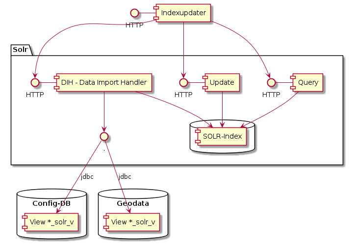

# INDEXUPDATER

Http service coordinating partial index reloading for solr. For an object-group, it first deletes all documents of this group, 
and then reloads them from source using the solr DataImportHandler (DIH).

Further documentation in german...

## Zusammenfassung

Uebersetzung der obenstehenden einleitenden englischen Kapitels:

Der Indexupdater ist ein http-Service, welcher das partielle neu Laden eines zusammengesetzten Indexes koordiniert. 
Für eine neu zu ladenede Dokumentgruppe werden zuerst alle Dokumente aus dem Index gelöscht. 
Anschliessend werden die Dokumente mittels DataImportHandler (DIH) neu geladen. 

## Funktionsweise und genutzte API's



Der Indexupdater musste erstellt werden, da die im Solr-DIH vorhandenen "Bordmittel" für die Pflege des Indexes
der GDI-SO nicht ausreichen. Mittels Solr-DIH kann nicht ein Teil des Indexes sauber aktualisiert werden.

Funktionsweise des Indexupdater am Beispiel der Gemeinden des Kt. Solothurn (ch.so.agi.gemeindegrenzen)
1. Mittels Solr-Update-API werden alle Gemeinde-Objekte aus dem Index gelöscht
1. Mittels DIH werden anschliessend alle Gemeinde-Objekte aus dem Quelldatensatz neu geladen. Mit der entsprechenden 
"Solr-View" werden die Gemeindedaten in die vom Index benötigte Struktur umgewandelt.
1. Mit dem Solr-Query-API wird sichergestellt, dass die Gemeinden korrekt wieder in den Index aufgenommen wurden.   

### Job-Queue

Damit die GRETL-Jobs nicht auf die Indexaktualisierung warten müssen, geben sie dem Indexupdater ein Aktualisierungs-Job,
welcher innerhalb des Indexupdaters in einer Queue abgespeichert wird.
Ein Background-Job prüft regelmässig, ob sich Aktualisierungs-Jobs in der Queue befinden, und arbeitet diese ab.

Hinweis: Die Queue ist nicht persistiert. Wenn das Pod des Indexupdaters "stirbt", können Aktualisierungs-Job's
verloren gehen. Ggf. müssen die im log vor dem Tod ausgegebenen pendenten Jobs nach dem Neustart des Pods manuell
neu beauftragt werden.

## Konfigurieren und Starten

Der Indexupdater wird als Docker-Image bereitgestellt: https://hub.docker.com/r/sogis/indexupdater. Der im Docker Image genutzte Webserver startet auf Port 8080.

**Zu beachten:** 
* Der Indexupdater ist nicht geeignet für den Parallelbetrieb in mehreren Containern, da der State des Indexupdaters im Arbeitspeicher des Containers gehalten wird.
* SolrCloud: Der Indexupdater ist darauf angewiesen, dass die Requests immer vom leader oder derselben replica verarbeitet werden. Aufgrund des Load-Balancing werden sonst die DIH-Insert- und DIH-Status-Befehle zufällig und nicht interpretierbar an leader und replica verteilt. 
  
Die Konfiguration erfolgt über die Umgebungsvariable SPRING\_APPLICATION\_JSON. Parameter:
* solrProtocol: http oder https
* solrHost: Der Hostname des anzusprechenden Solr-Servers
* solrPort: Der Port des anzusprechenden Solr-Servers
* solrPathQuery: Der Pfad, auf welchem die "select count" an den entsprechenden Index geschickt werden.
* solrPathUpdate: Der Pfad, auf welchem "updates" an den entsprechenden Index, resp. die Collection geschickt werden kann. Update wird verwendet, um den entsprechenden Teil des Index vor dem Insert zu löschen.
* logSilenceMaxDurationSeconds: Definiert, wie lange bei Inaktivität vom Backgroundworker kein Logeintrag geschrieben wird.
* dihPollIntervalSeconds: Bestimmt, in welchem Abstand bei einem laufenden DIH-Import eines Statusaktualisierung von Solr angefordert wird.
* dihImportMaxDurationSeconds: Timeout, nach welchem Solr angewiesen wird, den Import eines Dataset abzubrechen.
* dihDefaultPath: Pfad zum Default-Importhandler. Parameter wird verwendet, sofern beim API-Aufruf der Importhandler nicht gesetzt ist.
* logLevel: Definiert, bis zu welchem Detaillierungs-Level Log-Nachrichten ausgegeben werden. Konfiguraierbare Levels: error, warn, info, debug

Beispielkonfiguration:

```json
SPRING_APPLICATION_JSON='{"solrProtocol":"http","solrHost":"localhost","solrPort":8983,"solrPathQuery":"solr/gdi/select","solrPathUpdate":"solr/gdi/update","logSilenceMaxDurationSeconds":5,"dihPollIntervalSeconds":2,"dihImportMaxDurationSeconds":120,"dihDefaultPath":"solr/gdi/dih","logLevel":"info"}'
```

## Benutzung / API-Dokumentation

Der Indexupdater wird ausschliesslich über HTTP-GET-Aufrufe genutzt. Es stehen die Pfade /update und /status zur Verfügung. /update für die Beauftragung eines neuen Aktualisierungsjobs, /status für die Abfrage des Status eines jobs, respektive für die Abfrage des Zustands des Indexupdaters als ganzes.

### Pfad /queue

Ein GET auf den Pfad /queue mit korrekten URL-Parametern erstellt die Aktualisierungsjobs für die übergebenen entity's (Tabellen / Views). Pro übergebener entity wird ein Job in die Queue gelegt und anschliessend abgearbeitet.

Beispiel-Aufruf:

``` http
http://localhost:8080/queue?ds=ch.so.agi.fill_10k_60k,ch.so.agi.fill&timeout=3
```

Beispiel Aufruf mit curl:

```
curl -i --max-time 20 http://indexupdater-production.dev.so.ch/queue?ds=ch.so.agi.av.nomenklatur.gelaendenamen
```

#### Zwingende Parameter
* ds: Identifier des/der dataset(s), für welche der Index neu geladen werden soll. Bei der Uebergabe mehrerer Datasets werden diese mit Komma getrennt.


#### Optionale Parameter

Uebergebene optionale Parameter überschreiben jeweils den bei der Installation mittels Umgebungsvariable SPRING\_APPLICATION\_JSON gesetzten Wert.
* dih: Pfad des zu verwendenden Dataimporthandlers. Siehe auch Kapitel Installation, dihDefaultPath.
* poll: Siehe Kapitel Installation, dihPollIntervalSeconds
* timeout: Siehe Kapitel Installation, dihImportMaxDurationSeconds

#### Antwort

Json-Array der Identifier der erstellten Jobs.

### Pfad /status

Gibt eine menschenlesbare Antwort zum Status des ganzen Indexupdaters zurück.

Zurückgegebener HTTP Status Code:
* 200 - Falls alle abgearbeiteten Jobs erfolgreich abgeschlossen haben
* 500 - Falls ein oder mehrere Jobs mit Fehler abgeschlossen haben

### Pfad /status/{job identifier}

Gibt eine maschinen- und menschenlesbare Antwort zum Status des angefragten Jobs zurück.

Antwort-Codes in der Response (HTTP Status-Code 200):
* PENDING: Job ist beauftragt und wartet in der Queue auf die Bearbeitung. 
* WORKING: Job wird von Solr gegenwärtig ausgeführt.
* ENDED_OK: Job wurde erfolgreich abgeschlossen.
* ENDED_ABORTED: Job wurde wegen Timeout-Ueberschreitung abgebrochen. Index kann bezüglich des betroffenen Datasets inkonsistent sein.
* ENDED_EXCEPTION: Job wurde aufgrund des Auftretens eines Fehlers abgebrochen. Index kann bezüglich des betroffenen Datasets inkonsistent sein.

Bei der Uebergabe eines unbekannten Job-Identifiers wird HTTP Status-Code 404 "not found" zurückgegeben. Der Indexupdater merkt sich lediglich die letzten 20 ausgeführten Jobs. 

Beispiel-Aufruf:

```
http://localhost:8080/status/yP
```

#### Hinweis zum Job-Identifier

Zentral in der Benutzung des API's sind die sogenannten Job-Identifier. Diese werden automatisch erzeugt mit den Anforderungen "kurz, gut lesbar und eindeutig". Garantiert eindeutig sind sie jeweils in einer Periode von 7 Tagen. Ueber längere Perioden können Duplikate nicht ausgeschlossen werden.

In der Praxis ist diese Rahmenbedingung kaum relevant, da immer der jüngste auf den Identifier passende Job zurückgegeben wird. 

## Entwicklerdokumentation

Das Programm umfasst drei Hauptteile:
* Mittels **ch.so.agi.solr.indexupdater.Controller.addJobToQueue(...)** werden neue Jobs in die Queue gelegt.
* Im Package ch.so.agi.solr.indexupdater.model ist der State der hängigen, laufenden, und abgeschlossenen Jobs hinterlegt. Die **QueueOfJobs** ist die zentrale Collection, in welche addJobToQueue(...) neue Jobs reinlegt.
* Mittels **ch.so.agi.solr.indexupdater.QueuePoller.runOnePoll()** wird von einem von Spring verwalteten Background-Prozess periodisch die Queue auf neu zu verarbeitende Jobs abgefragt. Wenn welche vorhanden sind, wird der älteste wartende Job gezogen und bearbeitet.

### Job-Verarbeitung

Die Job-Verarbeitung umfasst die folgenden Schritte
* Alle Dokumente der entsprechenden entity aus dem Index löschen. Verwendet das Solr [index path]/update API.
* Die Dokumente der entity neu aus der Datenbank laden. Verwendet den DataImportHandler (DIH)
* Ob die Schritte korrekt abgelaufen sind wird mittels Zählen der Dokumente vor und nach jedem Schritt sichergestellt. Verwendet das Solr [index path]/select API

Die Verarbeitung wird von den Klassen des package **ch.so.agi.solr.indexupdater.jobexec** verrichtet. Hauptsächlich durch:
* **IndexSliceUpdater**: Umfasst den Code für das Update einer entity gemäss den obig beschriebenen Schritten. Siehe IndexSliceUpdater.execute()
* **DihPoller**: Fragt Solr periodisch nach dem Zustand des laufenden Import-Prozesses. Wird von IndexSliceUpdater aufgerufen.


